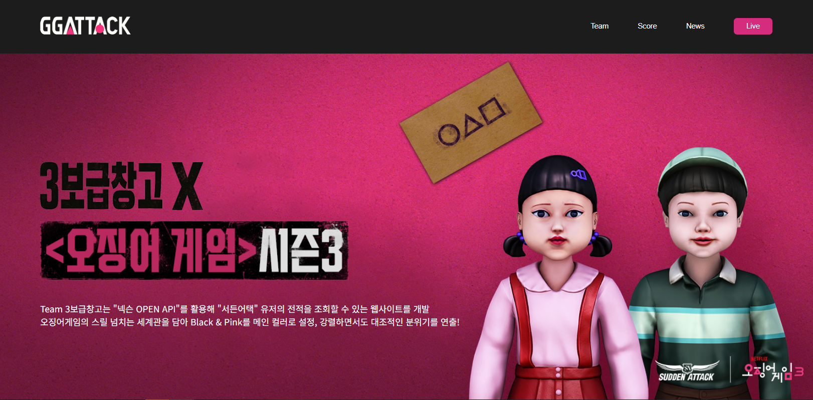
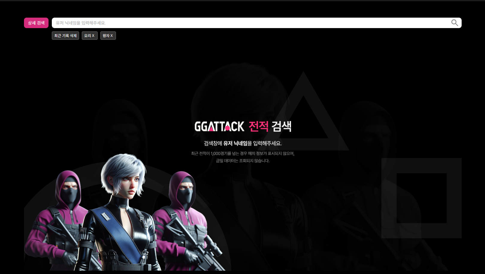
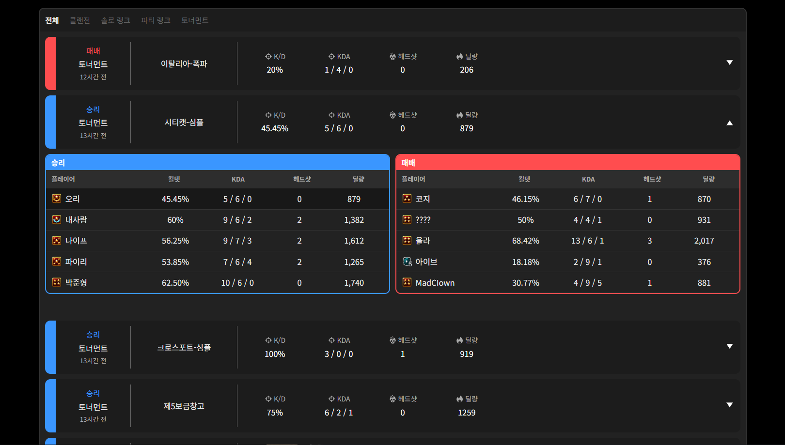
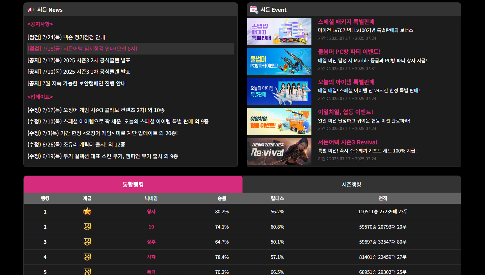
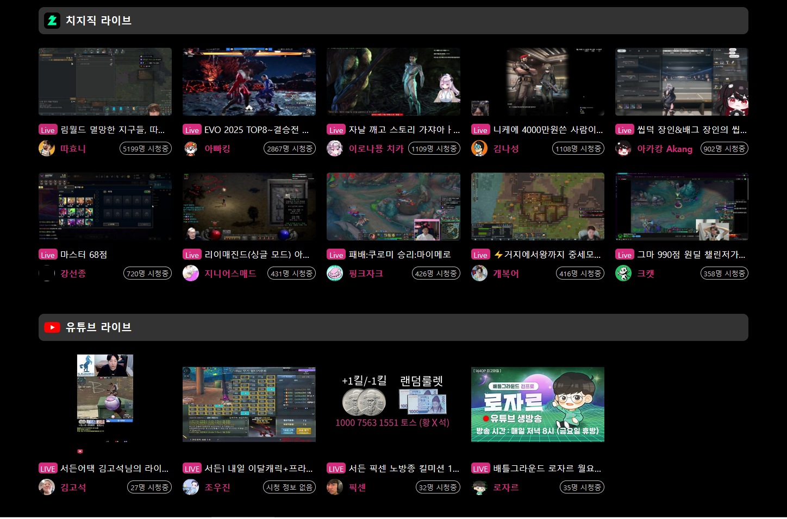

# 3보급창고 X 서든어택 전적 검색기 (EZ SCOPE)

**서든어택 유저의 전적을 닉네임 기반으로 검색하고, 게임 상세 데이터를 시각적으로 확인할 수 있는 웹 애플리케이션입니다.**  
JavaScript(바닐라), HTML, CSS로 구현하였으며, 넥슨 OPEN API를 활용하여 실시간 데이터를 불러옵니다.

---

## 📅 프로젝트 기간

2025년 7월 18일 ~ 2025년 8월 4일

---

## 🖥️ 배포 링크

👉 [https://js-project-team-3.netlify.app/home](https://js-project-team-3.netlify.app/home)

---

## 👨‍👩‍👧‍👦 팀원 소개

<table>
  <tr>
    <td align="center">
       
      <b>박민성</b> 
      PL, FE 
      뉴스,랭킹,라이브 컴포넌트 
      <a href="https://github.com/PMS990126">@PMS990126</a>
    </td>
    <td align="center">
       
      <b>심현보</b> 
      PM, FE 
      헤더,풋터,전적통계 컴포넌트 
      <a href="https://github.com/simhyenbo">@simhyenbo</a>
    </td>
    <td align="center">
       
      <b>윤정화</b> 
      FE 
      상세전적 컴포넌트 
      <a href="https://github.com/gomteang2">@gomteang2</a>
    </td>
    <td align="center">
       
      <b>한우창</b> 
      FE 
      사용자정보,검색바 컴포넌트 
      <a href="https://github.com/#id">@chan331</a>
    </td>
  </tr>
</table>

---

## 📌 주요 기능

- 🔍 닉네임 기반 유저 검색
- 🆔 OUID 조회 → 매치 ID → 매치 상세 정보 → 상대 전적 분석 흐름 구현
- 📊 최근 경기 정보, 킬/데스, 승패 여부 시각화
- 📱 반응형 웹 지원
- 🔐 Netlify Functions로 API Key 보호 (서버리스 프록시 사용)

---

## 📸 스크린샷

---

## ⚙️ 사용 기술

- HTML / CSS / JavaScript (Vanilla)
- Netlify Functions (API Proxy)
- Git & GitHub 협업

---

## 📚 참고자료
 [Nexon OPEN API (서든어택)](https://openapi.nexon.com/ko/game/suddenattack/?id=43)

