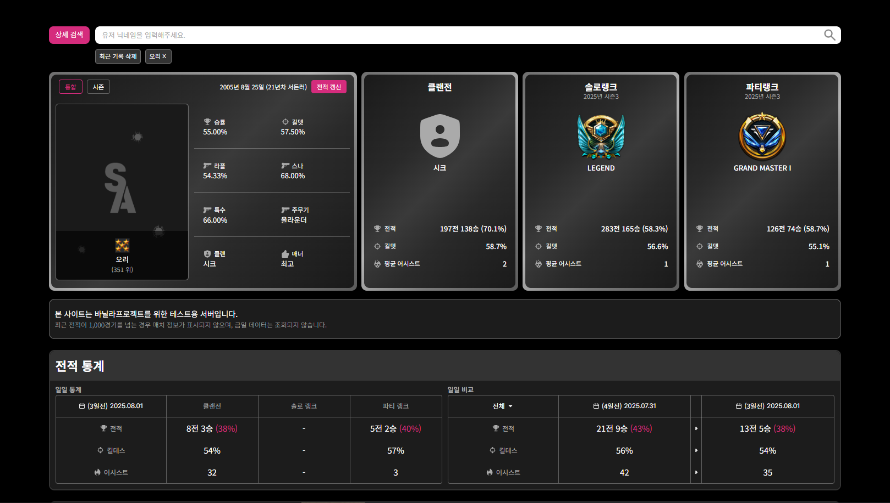

# 3보급창고 X 서든어택 전적 검색기 (EZ SCOPE)

**서든어택 유저의 전적을 닉네임 기반으로 검색하고, 게임 상세 데이터를 시각적으로 확인할 수 있는 웹 애플리케이션입니다.**  
JavaScript(바닐라), HTML, CSS로 구현하였으며, 넥슨 OPEN API를 활용하여 실시간 데이터를 불러옵니다.

---

## 📅 프로젝트 기간

2025년 7월 18일 ~ 2025년 8월 4일

---

## 🖥️ 배포 링크

👉 [https://js-project-team-3.netlify.app/home](https://js-project-team-3.netlify.app/home)

---

## 👨‍👩‍👧‍👦 팀원 소개

<table>
  <tr>
    <td align="center">
       
      <b>박민성</b> 
      PL, FE 
      뉴스,랭킹,라이브 컴포넌트 
      <a href="https://github.com/PMS990126">@PMS990126</a>
    </td>
    <td align="center">
       
      <b>심현보</b> 
      PM, FE 
      헤더,풋터,전적통계 컴포넌트 
      <a href="https://github.com/simhyenbo">@simhyenbo</a>
    </td>
    <td align="center">
       
      <b>윤정화</b> 
      FE 
      상세전적 컴포넌트 
      <a href="https://github.com/gomteang2">@gomteang2</a>
    </td>
    <td align="center">
       
      <b>한우창</b> 
      FE 
      사용자정보,검색바 컴포넌트 
      <a href="https://github.com/#id">@chan331</a>
    </td>
  </tr>
</table>

---

## 📌 주요 기능

- 🔍 닉네임 기반 유저 검색
- 🆔 OUID 조회 → 매치 ID → 매치 상세 정보 → 상대 전적 분석 흐름 구현
- 📊 최근 경기 정보, 킬/데스, 승패 여부 시각화
- 📱 반응형 웹 지원
- 🔐 Netlify Functions로 API Key 보호 (서버리스 프록시 사용)

---

## SPA 아키텍처 플로우차트

```mermaid
graph TD
    A["브라우저 접속"] --> B["index.html 로드"]
    B --> C["main.js 실행"]
    C --> D["initApp 함수 호출"]
    D --> E["Header 렌더링"]
    D --> F["현재 URL 확인"]
    F --> G{"URL 경로 분석"}
    G -->|"/home"| H["홈페이지 렌더링"]
    G -->|"/score"| I["전적 페이지 렌더링"]
    G -->|"/news"| J["뉴스 페이지 렌더링"]
    G -->|"/live"| K["라이브 페이지 렌더링"]
    D --> L["Footer 렌더링"]
    
    H --> M["메인 비주얼"]
    H --> N["팀 소개"]
    H --> O["컨벤션"]
    H --> P["메인 버튼"]
    
    I --> Q["검색바"]
    I --> R["전적 조회"]
    R --> S["API 호출"]
```

##  컴포넌트 구조 다이어그램

```mermaid
graph LR
    A["main.js<br/>중앙컨트롤러"] --> B["header.js"]
    A --> C["home.js"]
    A --> D["score.js"]
    A --> E["news.js"]
    A --> F["live.js"]
    A --> G["footer.js"]
    
    C --> H["main-visual.js"]
    C --> I["team-intro.js"]
    C --> J["convention.js"]
    C --> K["main-button.js"]
    
    D --> L["searchbar.js"]
    D --> M["record.js"]
    D --> N["user-info.js"]
    D --> O["score-detail.js"]
```

## 프록시 패턴 구조도

```mermaid
graph LR
    A["브라우저"] -->|"요청"| B["Netlify 프록시"]
    B -->|"API키 추가"| C["넥슨 API"]
    C -->|"응답"| B
    B -->|"응답 전달"| A
    
    D["API 키"] -.->|"보관"| B
```

## 에러 처리 플로우 

```mermaid
graph TD
    A["사용자 닉네임 입력"] --> B{"입력값 검증"}
    B -->|"유효하지 않음"| C["에러 메시지 표시"]
    B -->|"유효함"| D["로딩 화면 표시"]
    D --> E["OUID 조회 API 호출"]
    E --> F{"응답 성공?"}
    F -->|"실패"| G["검색 결과 없음"]
    F -->|"성공"| H["사용자 정보 API 호출"]
    H --> I{"응답 성공?"}
    I -->|"실패"| G
    I -->|"성공"| J["병렬 API 호출"]
    J --> K["데이터 가공"]
    K --> L["UI 렌더링"]
    L --> M["로딩 화면 숨김"]
```

## 데이터 플로우 다이어그램

```mermaid
graph TD
    A["Raw API Data"] --> B["데이터 검증"]
    B --> C["데이터 가공"]
    C --> D["UI 형태 변환"]
    D --> E["컴포넌트 렌더링"]
    
    F["에러 발생"] --> G["에러 처리"]
    G --> H["사용자 알림"]
```

## 📸 스크린샷

---

## ⚙️ 사용 기술

- HTML / CSS / JavaScript (Vanilla)
- Netlify Functions (API Proxy)
- Git & GitHub 협업

---

## 📚 참고자료
 [Nexon OPEN API (서든어택)](https://openapi.nexon.com/ko/game/suddenattack/?id=43)

